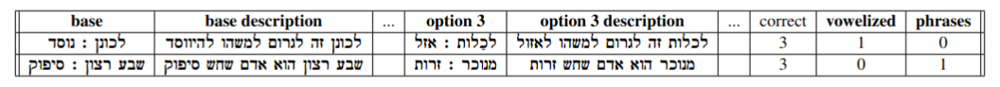

# HeAna: Hebrew Analogies 

HeAna is a complex analogy dataset that contains 552 relations structured as four-choice cloze-questions. Each sample includes five context sentences; two of them describe the correct relation
and the other three demonstrate why the other relations are false. Additionally, we include multiple experimental setups attempting to solve the questions.


The data in HeAna was collected from The National Institute
for Testing and Evaluation ([NITE](https://www.nite.org.il/psychometric-entrance-test/preparation/hebrew-practice-tests/?lang=en)) and from the Nir-Revach solutions archive ([Revach](https://www.psychometry.co.il/nite-exams.php)). 


Besides the classification question and context sentences, each sample contains the following metadata: The question’s difficulty, whether it was originally written with
Niqqud and does it include proverbs or phrases.


## Dataset
HeAna has three splits: train, test, and validation, by the fractions 90%, 5%, and 5% respectively.

An example sample is shown below: 




## In this Repo

 ### Data  
- Datasets:
  - AnalogiesData.csv: HeAna dataset.
  - PsychometricAnalogies.csv: Original psychometric questions.

- Morphology:  
  - yap_morph.ipynb - Runs Yap on given sentences
  - run_trankit.py - Runs Trankit
  - from_trankit_to_csv.ipynb, MorphologicalAnalysis.py - Produce csv files .  
- DataPreprocessor.p - Preprocessing psychometric questions to HeAna.  
- DataAnalysis.py - Analysis of HeAna.  
- ModelDataPreprocessor.py - A model for preparing the data for the model.   
- data_scraping.py - The code for scraping the analogies form the NITE.  


 ### Model  
- GenerativeTraining.py - hebrew-gpt_neo-xl training.    
- ABGTraining.py - ABG training.

## Citation

```
@unpublished{heanaproject,
    title = "HeAna - Hebrew Analogies",
    author = "Maxim Ifergan, Esther Shizgal, and Mor Turgeman",
    year = "2023",
}
```

